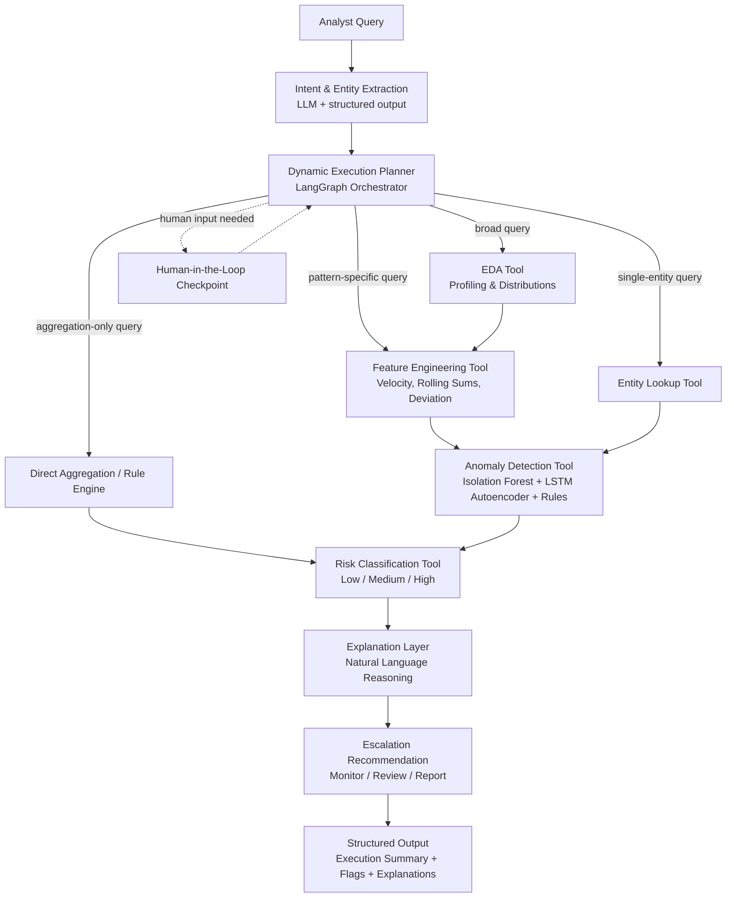

# LedgerLens
 
**Where Every Query Gets the Right Investigation.**
 
An agentic AI system for on-demand Anti-Money Laundering (AML) investigation. Instead of running every transaction through a fixed, expensive pipeline, LedgerLens reads the analyst's query, decides what actually needs to happen, and invokes only the relevant tools — then explains every flag in plain English.
 
---
 
## Table of Contents
 
- [Problem Statement](#problem-statement)
- [Why Traditional AML Systems Fail](#why-traditional-aml-systems-fail)
- [Our Solution Approach](#our-solution-approach)
- [Architecture](#architecture)
- [Tech Stack](#tech-stack)
- [Dataset Information](#dataset-information)
- [Data Sources](#data-sources)
- [Project Structure](#project-structure)
- [Setup](#setup)
- [Usage](#usage)
- [Example Queries](#example-queries)
- [Team](#team)
- [License](#license)
---
 
## Problem Statement
 
### AI-Powered Suspicious Activity Detection
#### Business Summary:
Financial institutions globally are mandated by regulatory bodies (FinCEN, FATF, local authorities) to implement robust Anti-Money Laundering (AML) compliance programs. However, traditional rule-based systems generate excessive false positives, overwhelming compliance teams and increasing operational costs. Meanwhile, sophisticated money laundering techniques—including structuring , smurfing, and layering evade conventional detection methods.
The challenge is to build an intelligent, autonomous agent that can learn from transaction patterns, identify suspicious behaviours, and provide explainable risk assessments with actionable escalation recommendations. Such an agent would reduce false positives, improve detection accuracy, and enable compliance teams to focus on genuine threats rather than manual rule tuning.
### Objective:
Participants are required to design and implement an AI-powered agent that:
1.	Performs automated exploratory data analysis (EDA) on transaction and customer data to understand baseline behavior
2.	Detects anomalous transaction patterns indicative of money laundering (example - structuring/smurfing)
3.	Applies anomaly detection (e.g., any ML-based approach, rule based or Hybrid)
4.	Generates a risk score or flag per transaction/customer
5.	Provides a explanation for why a transaction is flagged as suspicious
6.	Recommends a basic escalation action (monitor / flag for review / report)

---
 
## Why Traditional AML Systems Fail
 
| Query | What a Fixed Pipeline Does (Wasteful) | What LedgerLens Does |
|---|---|---|
| "Find structuring patterns in the last 30 days" | Runs full EDA + every detector on the whole dataset | Applies time filter, runs only structuring-focused feature engineering and detection |
| "Which customers made 10+ transactions under $10,000?" | Runs ML anomaly detection unnecessarily | Runs a direct aggregation/threshold rule — no ML needed |
| "Is customer ID 4521 suspicious?" | Reprocesses the entire dataset | Performs a single-entity lookup and computes/explains risk on demand |
 
This selective, query-driven behavior — not the ML model itself — is the core engineering challenge and the core differentiator of this project.
 
---
## Our Solution Approach
 
1. **Intent & Entity Extraction** — Parse the analyst's natural language query to extract intent, filters (date range, customer ID, transaction type, country), and the target AML pattern (structuring, layering, cash-out, or general).
2. **Dynamic Execution Planning** — A LangGraph-based orchestrator decides, per query, which tools to call, in what order, and on what data subset. Not every query touches every tool.
3. **Selective EDA** — Full exploratory analysis only runs for broad/exploratory queries; skipped entirely for targeted or single-entity queries.
4. **On-Demand Feature Engineering** — Transaction frequency, rolling sums, amount deviation from baseline, transaction velocity, and rapid cash-out ratios, computed only for the relevant subset.
5. **Hybrid Anomaly Detection** — Statistical methods (z-score, IQR) combined with ML-based detection (Isolation Forest for tabular anomalies, LSTM autoencoder for sequential/behavioral anomalies) and rule-based checks for known typologies.
6. **Risk Classification** — Converts anomaly scores into low/medium/high risk using context-aware thresholds.
7. **Explanation Layer** — Generates a concise, human-readable reason for every flag, tied directly to the query and the detected pattern.
8. **Escalation Recommendation** — Suggests monitor / flag for review / report, based on risk level and pattern type.
9. **Transparent Output** — Every response includes the query-aware execution summary: what was asked, what filters/entities were detected, which tools were invoked, and why — so a reviewer (or judge) can audit the agent's reasoning, not just its output.
---
 
## Architecture
 

 
**Key design principle:** the Dynamic Execution Planner is a LangGraph state machine, not a linear script. Each node is conditionally invoked based on the extracted intent — this is what makes the system "agentic" rather than a fixed pipeline with a chatbot wrapper on top.
 
---
## Tech Stack

| Layer | Technology |
|---|---|
| Agent Orchestration | LangGraph |
| LLM Reasoning / Intent Parsing | LangChain + LLM (Gemini / Claude / GPT via API) |
| Structured Output | Pydantic-based output parsing |
| Tool Exposure | FastMCP |
| Statistical Anomaly Detection | scikit-learn (Isolation Forest, DBSCAN, z-score/IQR) |
| Behavioral/Sequential Anomaly Detection | LSTM Autoencoder (PyTorch / Keras) |
| Backend / API | FastAPI |
| Frontend | Streamlit (or React for dashboard polish) |
| Observability | LangSmith — execution trace visibility for judges/reviewers |
| Data Processing | pandas, NumPy |
| Human-in-the-Loop | LangGraph interrupt/checkpoint |
| Version Control / CI | Git, GitHub, GitHub Actions |

---

## Dataset Information

*Primary dataset: SAML-D (Synthetic AML Transaction Monitoring Dataset)*

- 12 features and 28 labeled money-laundering typologies, covering a wide range of geographic regions, high-risk countries, and high-risk payment types
- Built with input from real AML specialists, making its typologies closer to real compliance scenarios than generic fraud datasets
- Chosen as the primary dataset because it is typology-labeled (not just binary fraud/not-fraud), which directly supports pattern-specific queries like structuring or layering

*Secondary dataset: IBM Transactions for Anti-Money Laundering (HI-Small split)*

- Synthetic transaction data generated by a multi-agent virtual-world simulator, modeling the full laundering cycle: placement, layering, and integration
- Models 8 distinct laundering patterns: fan-in, fan-out, bipartite, stack, random, cycle, scatter-gather, gather-scatter
- Used as a supplementary/benchmark dataset; the HI-Small split (~515K nodes, ~5M edges) is used to keep processing time feasible within the hackathon window

*Fallback dataset: PaySim*

- ~6.3M synthetic mobile-money transactions over a 30-day simulated period, with transaction types CASH-IN, CASH-OUT, DEBIT, PAYMENT, TRANSFER
- Used only as a lightweight fallback for quick EDA/demo purposes if processing time on the primary datasets becomes a constraint

---

## Data Sources

| Dataset | Link | Used For |
|---|---|---|
| SAML-D | https://www.kaggle.com/datasets/berkanoztas/synthetic-transaction-monitoring-dataset-aml | Primary training/testing data — typology-labeled |
| IBM AML Dataset (HI-Small) | https://www.kaggle.com/datasets/ealtman2019/ibm-transactions-for-anti-money-laundering-aml | Secondary benchmark — multi-pattern laundering cycle |
| PaySim | https://www.kaggle.com/datasets/ealaxi/paysim1 | Fallback — lightweight demo/EDA dataset |

---

