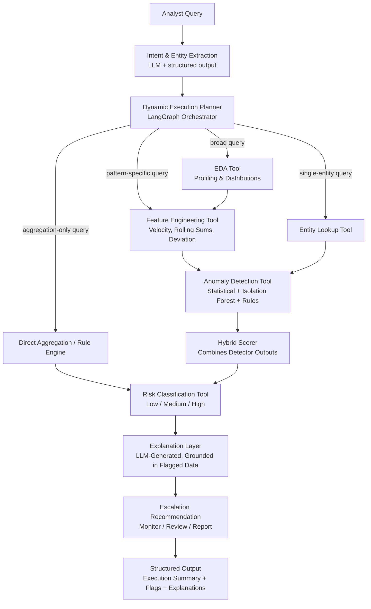

# LedgerLens
 
**Where Every Query Gets the Right Investigation.**
 
An agentic AI system for on-demand Anti-Money Laundering (AML) investigation. Instead of running every transaction through a fixed, expensive pipeline, LedgerLens reads the analyst's query, decides what actually needs to happen, and invokes only the relevant tools — then explains every flag in plain English.
 
---
<div align="center">


<br/>


</div>


## Table of Contents
 
- [Problem Statement](#problem-statement)
- [Why Traditional AML Systems Fail](#why-traditional-aml-systems-fail)
- [Our Solution Approach](#our-solution-approach)
- [Architecture](#architecture)
- [Tech Stack](#tech-stack)
- [Dataset Information](#dataset-information)
- [Data Sources](#data-sources)
- [Project Structure](#project-structure)
- [Setup](#setup)
- [Usage](#usage)
- [Example Queries](#example-queries)
- [Team](#team)
- [License](#license)
---
 
## Problem Statement
 
### AI-Powered Suspicious Activity Detection
#### Business Summary:
Financial institutions globally are mandated by regulatory bodies (FinCEN, FATF, local authorities) to implement robust Anti-Money Laundering (AML) compliance programs. However, traditional rule-based systems generate excessive false positives, overwhelming compliance teams and increasing operational costs. Meanwhile, sophisticated money laundering techniques—including structuring , smurfing, and layering evade conventional detection methods.
The challenge is to build an intelligent, autonomous agent that can learn from transaction patterns, identify suspicious behaviours, and provide explainable risk assessments with actionable escalation recommendations. Such an agent would reduce false positives, improve detection accuracy, and enable compliance teams to focus on genuine threats rather than manual rule tuning.
### Objective:
Participants are required to design and implement an AI-powered agent that:
1.	Performs automated exploratory data analysis (EDA) on transaction and customer data to understand baseline behavior
2.	Detects anomalous transaction patterns indicative of money laundering (example - structuring/smurfing)
3.	Applies anomaly detection (e.g., any ML-based approach, rule based or Hybrid)
4.	Generates a risk score or flag per transaction/customer
5.	Provides a explanation for why a transaction is flagged as suspicious
6.	Recommends a basic escalation action (monitor / flag for review / report)

---
 
## Why Traditional AML Systems Fail
 
| Query | What a Fixed Pipeline Does (Wasteful) | What LedgerLens Does |
|---|---|---|
| "Find structuring patterns in the last 30 days" | Runs full EDA + every detector on the whole dataset | Applies time filter, runs only structuring-focused feature engineering and detection |
| "Which customers made 10+ transactions under $10,000?" | Runs ML anomaly detection unnecessarily | Runs a direct aggregation/threshold rule — no ML needed |
| "Is customer ID 4521 suspicious?" | Reprocesses the entire dataset | Performs a single-entity lookup and computes/explains risk on demand |
 
This selective, query-driven behavior — not the ML model itself — is the core engineering challenge and the core differentiator of this project.
 
---
## Our Solution Approach
 
1. **Intent & Entity Extraction** — Parse the analyst's natural language query to extract intent, filters (date range, customer ID, transaction type), and the target AML pattern (structuring, layering, cash-out, or general).
2. **Dynamic Execution Planning** — A LangGraph-based orchestrator decides, per query, which tools to call and in what order. Not every query touches every tool.
3. **Selective EDA** — Full exploratory analysis only runs for broad/exploratory queries; skipped entirely for targeted or single-entity queries.
4. **On-Demand Feature Engineering** — Rolling sums, transaction velocity, amount deviation from baseline, and unique-counterparty counts, computed only for the relevant subset.
5. **Hybrid Anomaly Detection** — Statistical methods (z-score/IQR) combined with Isolation Forest and rule-based structuring detection, merged via a hybrid scorer.
6. **Risk Classification** — Converts anomaly scores into low/medium/high risk using context-aware thresholds.
7. **Explanation Layer** — Generates a concise, human-readable reason for every flag, grounded in the actual flagged transaction data (accounts, amounts, detector reasoning) — not a generic template.
8. **Escalation Recommendation** — Suggests monitor / flag for review / report, based on risk level and pattern type.
9. **Transparent Output** — Every response includes the query-aware execution summary: what was asked, what filters/entities were detected, which tools were invoked, and why — so a reviewer can audit the agent's reasoning, not just its output.
---
 
## Architecture
 

 
**Key design principle:** the Dynamic Execution Planner is a LangGraph state machine, not a linear script. Each node is conditionally invoked based on the extracted intent — this is what makes the system "agentic" rather than a fixed pipeline with a chatbot wrapper on top.
 
---
## Tech Stack

| Layer | Technology |
|---|---|
| Agent Orchestration | LangGraph |
| LLM Reasoning / Intent Parsing | LangChain + LLM (Gemini / Claude / GPT via API) |
| Structured Output | Pydantic-based output parsing |
| Tool Exposure | FastMCP |
| Statistical Anomaly Detection | scikit-learn (Isolation Forest, DBSCAN, z-score/IQR) |
| Behavioral/Sequential Anomaly Detection | LSTM Autoencoder (PyTorch / Keras) |
| Backend / API | FastAPI |
| Frontend | Streamlit (or React for dashboard polish) |
| Observability | LangSmith — execution trace visibility for judges/reviewers |
| Data Processing | pandas, NumPy |
| Human-in-the-Loop | LangGraph interrupt/checkpoint |
| Version Control / CI | Git, GitHub, GitHub Actions |

---

## Dataset Information

*Primary dataset: SAML-D (Synthetic AML Transaction Monitoring Dataset)*

- 12 features and 28 labeled money-laundering typologies, covering a wide range of geographic regions, high-risk countries, and high-risk payment types
- Built with input from real AML specialists, making its typologies closer to real compliance scenarios than generic fraud datasets
- Chosen as the primary dataset because it is typology-labeled (not just binary fraud/not-fraud), which directly supports pattern-specific queries like structuring or layering

*Secondary dataset: IBM Transactions for Anti-Money Laundering (HI-Small split)*

- Synthetic transaction data generated by a multi-agent virtual-world simulator, modeling the full laundering cycle: placement, layering, and integration
- Models 8 distinct laundering patterns: fan-in, fan-out, bipartite, stack, random, cycle, scatter-gather, gather-scatter
- Used as a supplementary/benchmark dataset; the HI-Small split (~515K nodes, ~5M edges) is used to keep processing time feasible within the hackathon window

*Fallback dataset: PaySim*

- ~6.3M synthetic mobile-money transactions over a 30-day simulated period, with transaction types CASH-IN, CASH-OUT, DEBIT, PAYMENT, TRANSFER
- Used only as a lightweight fallback for quick EDA/demo purposes if processing time on the primary datasets becomes a constraint

---

## Data Sources

| Dataset | Link | Used For |
|---|---|---|
| SAML-D | https://www.kaggle.com/datasets/berkanoztas/synthetic-transaction-monitoring-dataset-aml | Primary training/testing data — typology-labeled |
| PaySim | https://www.kaggle.com/datasets/ealaxi/paysim1 | Fallback — lightweight demo/EDA dataset |

---
## Project Structure
 
```
LedgerLens/
├── agent/                          # LangGraph orchestrator and nodes
│   ├── config.py                   # Model configuration
│   ├── graph.py                    # StateGraph definition and conditional routing
│   ├── intent_extractor.py         # LLM-based query parsing into structured intent
│   ├── planner.py                  # Builds the dynamic execution plan per intent
│   ├── run_agent.py                # CLI entrypoint for testing
│   ├── schemas.py                  # Pydantic schemas for extracted intent
│   ├── state.py                    # Shared AgentState definition
│   └── nodes/                      # One file per orchestrated tool
│       ├── aggregation_node.py
│       ├── anomaly_node.py
│       ├── eda_node.py
│       ├── entity_lookup_node.py
│       ├── escalation_node.py
│       ├── explanation_node.py
│       ├── feature_engineering_node.py
│       └── risk_node.py
├── api/
│   ├── main.py                     # FastAPI backend (/investigate, /health)
│   └── example_requests.md         # Sample curl requests and responses
├── data/
│   ├── loader.py                   # Dataset loading and cleaning
│   ├── sample_saml_d.csv           # Small sample for testing (committed)
│   ├── full_saml_d.csv             # Full dataset (gitignored — download separately)
│   ├── threshold_analysis.py       # Threshold sweep analysis
│   └── typology_mapping.json       # AML pattern-to-typology mapping
├── frontend/
│   ├── app.py                      # Streamlit dashboard
│   └── requirements_frontend.txt
├── tools/                          # Anomaly detection implementations
│   ├── statistical_detector.py     # Z-score / IQR detection
│   ├── isolation_forest_detector.py
│   ├── rule_based_detector.py      # Structuring/smurfing rule engine
│   ├── hybrid_scorer.py            # Combines all detector outputs
│   └── feature_prep.py             # Rolling sums, velocity, deviation features
├── tests/
│   ├── test_router.py              # Intent/planner routing tests
│   ├── test_anomaly_engine.py      # Detector output contract tests
│   └── test_rule_based_detector.py # Structuring rule unit tests
├── eval_anomaly_engine.py          # Ground-truth precision/recall/lift evaluation
├── eval_account_level.py           # Account-level lift analysis
├── notebooks/                      # EDA and prototyping notebooks
├── requirements.txt
├── pytest.ini
└── README.md
```
 
---
 
## Setup
 
### Prerequisites
- Python 3.10+
- pip / virtualenv
- API key for your chosen LLM provider (Gemini)
### Installation
 
```bash
git clone https://github.com/Yes-Amrit/LedgerLens.git
cd LedgerLens
 
python -m venv venv
source venv/bin/activate      # Windows: venv\Scripts\activate
 
pip install -r requirements.txt
```
 
### Environment Variables
 
Create a `.env` file in the root directory (see `.env.example` for the template):
 
```
LLM_API_KEY=your_api_key_here
LANGSMITH_API_KEY=your_langsmith_key_here   # optional, for tracing
```
 
### Dataset
 
A small sample dataset (`data/sample_saml_d.csv`) is already committed to the repo for quick testing. For full-scale runs, download the complete SAML-D dataset from Kaggle (see Data Sources) and place it at `data/full_saml_d.csv` — this file is gitignored due to its size (~1GB, 9M+ rows).
 
---
 
## Usage
 
### Run the Backend
 
```bash
uvicorn api.main:app --reload
```
 
The API will be available at `http://localhost:8000`. Confirm it's running with:
 
```bash
curl http://localhost:8000/health
```
 
### Run the Frontend
 
In a separate terminal, with the backend already running:
 
```bash
streamlit run frontend/app.py
```
 
Open `http://localhost:8501` in your browser. Use the sidebar's example query buttons for a quick demo, or type your own natural language query.
 
### Run via CLI (for quick testing without the UI)
 
```bash
python -m agent.run_agent --query "Find structuring patterns in the last 30 days"
```
 
### Run Tests
 
```bash
python -m pytest
```
 
---
 
## Example Queries
 
| Query | Expected Behavior |
|---|---|
| "Find structuring patterns in the last 30 days" | Time filter applied; only structuring-focused feature engineering and anomaly detection run; full EDA skipped |
| "Which customers made 10+ transactions under $10,000?" | Direct aggregation and threshold rule; no ML invoked |
| "Is customer ID [X] suspicious?" | Single-entity lookup; existing flags explained or risk computed on demand |
| "Show me an overview of transaction patterns" | Full EDA tool invoked for broad exploration |
 
Every response returns:
1. A query-aware execution summary (what was asked, what was detected, which tools ran)
2. Top suspicious transactions/accounts for that query
3. Risk level per flagged item
4. A plain-English explanation for each flag, grounded in the actual flagged transaction data (not templated)
5. A suggested escalation action (monitor / review / report)
---
 
## Validation Results
 
We validated detection performance against SAML-D's ground-truth labels (`Is_laundering`, `Laundering_type`) rather than relying on unverified claims. The dataset's structuring cases are extremely rare (77 labeled cases in a 27,480-transaction evaluation split — a 0.28% base rate), which makes raw precision a misleading metric on its own; we report lift over baseline alongside it for honest context.
 
**Two detection modes, two different trade-offs:**
 
| Mode | Recall | Precision | Lift over Baseline | Transactions/Accounts Flagged |
|---|---|---|---|---|
| Hybrid Pipeline (Statistical + Isolation Forest + Rules) | 4.16% | 3.12% | **8.45x** | 128 of 25,978 transactions (0.49%) |
| Rule-Based Structuring (account-level) | 66.7% | 5.80% | 1.45x | 46% of accounts |
 
- The **Hybrid Pipeline** is a high-precision, conservative filter — when it flags a transaction, it is meaningfully more likely to be genuine laundering activity than chance would suggest, at the cost of missing most cases.
- The **Rule-Based Structuring detector** is a high-sensitivity net — it catches two-thirds of obscured structuring behavior at the account level, intended as a first-pass filter for further review rather than a final verdict.
We report both configurations rather than picking whichever number looks best in isolation, since the right trade-off depends on whether an institution prioritizes catching more cases (recall) or reducing analyst alert fatigue (precision).
 
---
 
## Team
 
Built by Amrit and Dhairya.
 
- **Amrit** — Agent orchestration (LangGraph), intent parsing, dynamic execution planning, explanation layer, API, frontend
- **Dhairya** — Anomaly detection (statistical + Isolation Forest + rule-based), feature engineering, ground-truth validation
---
 
## License
 
This project is released under the MIT License. Datasets used are subject to their respective original licenses (see Data Sources above).
 
